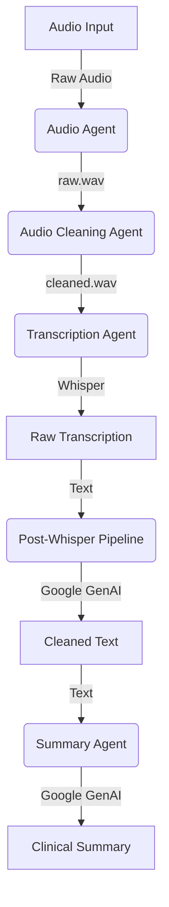

# Technical Flow and Methodology

This document outlines the technical architecture, data flow, and methodology used in the **HealthCare Assistant** project.

## 🏗️ Architecture Overview

The system is designed as a modular pipeline of independent agents, each responsible for a specific stage of audio processing and text analysis. The core workflow transforms raw consultation audio into structured clinical summaries.

### Component Diagram

## 🔄 Technical Flow

### 1. Data Acquisition (Audio Agent)
*   **File:** `agents/audio_agent.py`
*   **Methodology:**
    *   Uses `sounddevice` to capture audio from the microphone.
    *   Records in chunks to memory and concatenates them using `numpy`.
    *   Saves the output as a standard wav file (`audio/raw.wav`).
    *   **Key Feature:** Supports long-duration recording (up to 30 minutes) with a manual stop (`Ctrl+C`).

### 2. Signal Processing (Audio Cleaning Agent)
*   **File:** `agents/audio_cleaning_agent.py`
*   **Methodology:**
    *   Loads raw audio using `librosa`.
    *   Resamples audio to **16kHz** (Whisper's native sample rate) to ensure compatibility.
    *   Applies stationary noise reduction using `noisereduce` (spectral gating) to remove background hiss.
    *   Output is saved as `audio/cleaned.wav`.

### 3. Transcription (Transcription Agent)
*   **File:** `agents/transcription_agent.py`
*   **Methodology:**
    *   Utilizes **OpenAI's Whisper** model (configured to use the 'large' model for maximum accuracy).
    *   Processes `audio/cleaned.wav` and outputs English text.
    *   Uses `task="translate"` to ensure non-English audio is automatically translated to English during transcription.

### 4. Post-Processing (Post-Whisper Pipeline)
*   **File:** `agents/post_whisper_accuracy_pipeline.py`
*   **Methodology:**
    *   Uses **Google Gemini 2.0 Flash** via the `google-genai` SDK.
    *   **Prompt Engineering:** protects specific "Known Entities" (e.g., Doctor names, Hospital names) to prevent hallucinations or spelling errors common in phonetic transcription.
    *   Corrects medical terminology and grammar.
    *   **Robustness:** Implements logic to handle API rate limits (429 errors) with exponential backoff.

### 5. Summarization (Summary Agent)
*   **File:** `agents/summary_agent.py`
*   **Methodology:**
    *   Uses **Google Gemini 2.0 Flash** to analyze the corrected text.
    *   Generates a structured medical note focusing on:
        *   Symptoms
        *   Duration
        *   Severity
        *   Advice / Medications
    *   **Robustness:** Also implements retry logic for API rate limits.

## 🛠️ Technology Stack

| Component | Library / Service | Purpose |
| :--- | :--- | :--- |
| **Transcription** | `openai-whisper` | Speech-to-Text conversion |
| **LLM Inference** | `google-genai` | Text correction and summarization (Gemini 2.0 Flash) |
| **Audio Capture** | `sounddevice`, `numpy` | Microphone input handling |
| **Audio Processing** | `librosa`, `noisereduce` | Resampling and denoising |
| **Environment** | `python-dotenv` | Configuration security (API Keys) |

## 🚀 Key Algorithms

*   **Noise Reduction:** Spectral Gating (via `noisereduce`) estimation of noise from the signal to improve Signal-to-Noise Ratio (SNR) before transcription.
*   **Exponential Backoff:** Used in API calls to `google-genai` to manage quota limits (`RESOURCE_EXHAUSTED` errors), ensuring the agent doesn't crash during batch processing.
